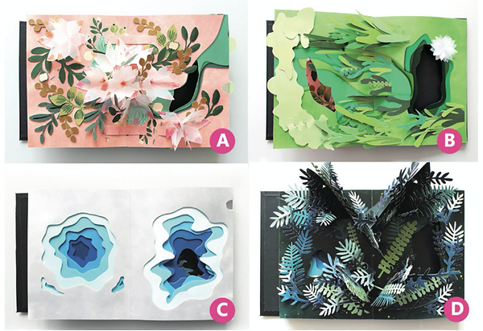
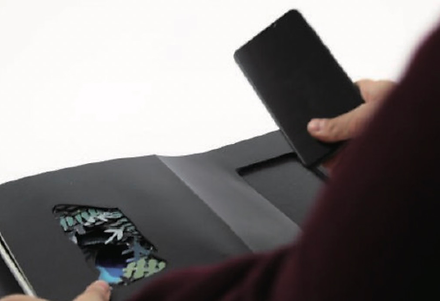
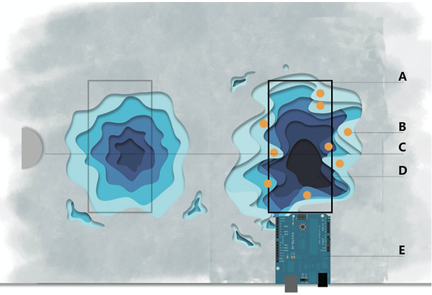
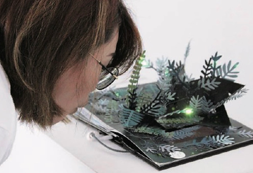

I’m motivated to create an embedded mixed-experience for children that allows for a more interactive experience that enhances the connection between digital information and the physical interface. I've been working on this topic for years, there is another project, see Popal is also trying to solve this problem. But it is not mature. After doing some research about children's cognitive and tangible interaction we came up with Beyond Paper. Beyond Paper is a design attempt which aims to put this theory into practice. We designed different scenarios to engage children with the book and hope they can achieve a more novel and emotional experience as well as a better understanding of the real-world. 

Beyond Paper is a smartphone app that uses a paper book as a physical extension. In lieu of normal printed paper we designed 3D paper structures for each page to create a more interactive and immersive atmosphere for children. By placing the phone in the book, the connection between the two parts is completed automatically via Bluetooth. The contents are synchronized between the display on the phone and the 3D paper book, which is the easy-to-access MR interface we propose for preschool children. Beyond Paper's interface provides information in multiple dimensions, including images, 3D paper structures, light effects, color changes and sounds. It encourages children to interact with Beyond Paper instinctively with diverse behaviors. 

<video width="100%" controls poster="../assets/images/beyond-paper/beyond-paper.jpg">
    <source src="https://user-images.githubusercontent.com/3339663/193571879-82bc6dbc-6361-47bd-b8c2-b07fb5113937.mp4" type="video/mp4">
</video>

## INTERACTIVE GESTURE

We believe that the best way to create an immersive experience is to embed various interactive gestures. Interactive gesture design is a critical part of Beyond Paper. We aim to stimulate children’s intuitive responses to the physical environment and present a consistent multi-dimensional narrative story by connecting the major interactive behaviors and content of the story book. The gestures we include in Beyond Paper are based on the real natural environment. There is always a certain action when we interact with a physical object in a specific scene. For example, blowing is a unique but spontaneous behavior when we see dandelions, while most children rarely have the chance to experience this pleasure. Furthermore, some behaviors contain strong emotive meaning. For example, the gesture of parents covering their children with their hands from rain means protection and love. Including these gestures in Beyond Paper is an important method of combining two different mediums naturally.

## STORYTELLING and SCENARIOS

To immerse children in Beyond Paper, we designed four MR scenarios (see figure1), which we believe are of high educational value and can lead to emotional resonance. 《Beyond Paper》is a jungle adventure story book where the audience can experience the changing seasons and different tropical landscapes as they traverse the book’s pages.

<figure>
    
    <figcaption>Figure1. Four scenarios in Beyond Paper. A–a blooming flower; B –sapling in the rain; C–pond; D- flickering fireflies.</figcaption>
</figure>

The first scene (see Figure 1-A) is a blooming flower by the river. There are 3D paper structures with flowers which will change colors when the audience touch- es them. In this page, we attempt to simulate the situation of people who encounter real flowers where touch and smell are in action. The following page (see Figure 1-B) presents a scene of a sapling sitting in the rain next to a pond that calls for protection of children. A brittle sapling inspires the child’s compassion to put their hands above it, as they would in real life to protect themselves from the rain. The gesture is captured on a sensor installed at ‘Beyond Paper’ and a sapling is placed on the screen to give the children positive feedback. Once the audience has reached the deep pool we will return to page 3 (see Figure 1-C). Dipping a finger into the pond, the pond ripples gently. The water ripples go from the screen to the paper structure, and it reveals on the paper instead of only showing on screen. On the last page (see Figure 1-D), we present an image of flickering fireflies in the bushes. As the audience blows toward the illuminated dots, fireflies scatter from screen to paper. This effect is created by the LED lights that are hid- den in the paper structure. Simulation preserves key features of interactions from the physical world, and also takes advantage of the flexibility of virtual information. It gives children a lively environment and provokes intuitive interaction. This is what we think is an effective way to construct a mixed reality system.

## TEHNICAL DEVELOPMENT

We developed the MR prototype of the Beyond Paper that combines a 3D paper book containing Bluno (an Arduino board with a Bluetooth module), sensors and circuits with an Android touch-screen mobile device, two parts connected via Blue- tooth (see Figure 2). We use sensors from both sides to detect the audience’s gestures, such as pressure sensors on the paper structure for detecting the touch of the flowers on Page1; microphone sensors on the mobile device for detecting blowing on the fireflies on the Page4.

<figure>
    
    <figcaption>Figure 2. Beyond Paper combines a 3D paper structure book containing Bluno .</figcaption>
</figure>

Two books are in the works, each with two pages. Each page has a mini touchpad sensor at the center of the book-edge (see Figure 3-C). A new scene appears and synchronizes the display on the mobile device with the 3D paper book when the audience turns the page by touching the mini touchpad sensor. On the back of the paper structure, each page is attached with circuits, LED lights and sensors for the book power supply and digital dynamic effect. A mobile device will be placed at a certain position in the book to collaborate with the physical book (see figure 5-A). For example, we embedded a pressure sensor in the origami flower on the first page, and when the audience touches the flower the color changes according to the force of their touch.

<figure>
    
    <figcaption>Figure 3. Technical solution for Page 3 - pond. A-a smart phone; B-mini LEDs attached with paper structure; C-mini touchpad sensor; D-touchscreen of the smart phone as the input of the pond; E-Bluno board.</figcaption>
</figure>

In the current implementation, we used a Samsung S8 with Android 9.0, although the program will run on any Android 9.0 or higher device, the software was developed on Android Studio. Sensors on a mobile device were used to detect audience gestures. For example, in Page 2, ambient light sensors on the front of the phone is be used to detect whether or not an audience is covering the sapling. On Page 3 (see Figure 3), when the audience touches the touchscreen, a signal will be sent from the mobile device to the Bluno board, and it will trigger the micro LED Stricker with conductive material to simulate the water ripples. The last page (see Figure 4), when the audience blows on the flickering fireflies resting on the display, is detected by the microphone, and the signal received by Bluno will illuminate the mini LEDs hidden in the paper structure bushes to create a firefly flickering effect.

<figure>
    
    <figcaption>Figure 4. Blowing flickering fireflies.</figcaption>
</figure>

In order to ensure that the audience is given an immersive experience, in which we hope to see the book as a complete object, neither the mobile device nor the physical book should be perceived. Designing the book so that the audience interacts with it in a spontaneous way of input also gains varying output feedback.