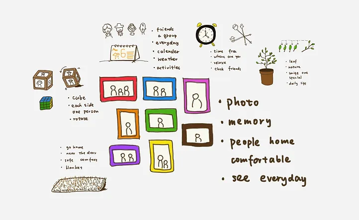
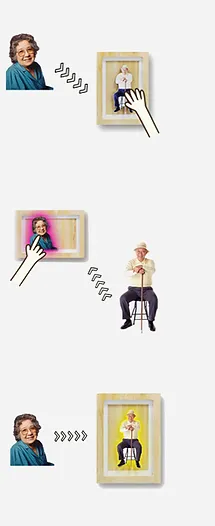
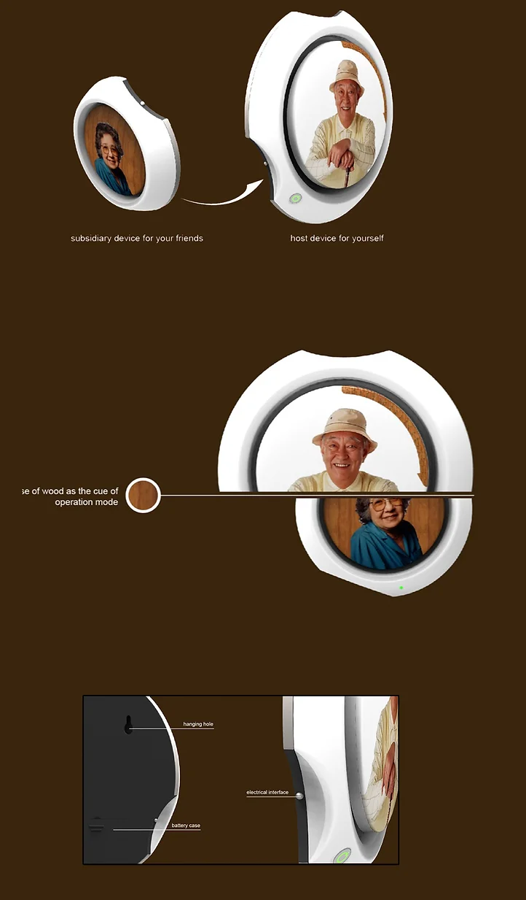
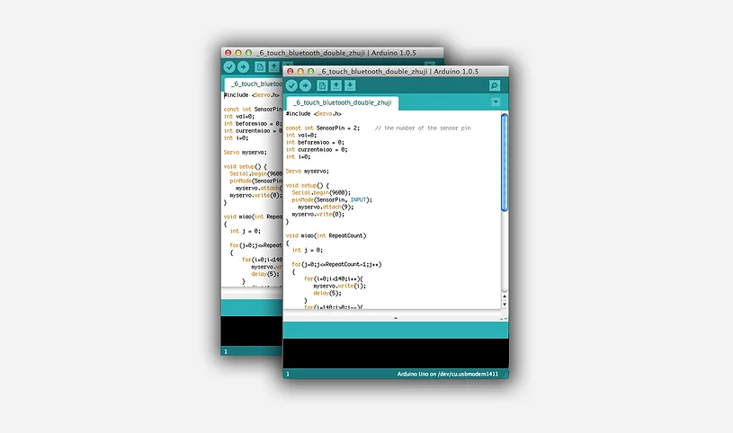
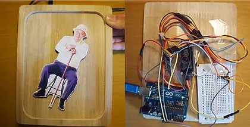
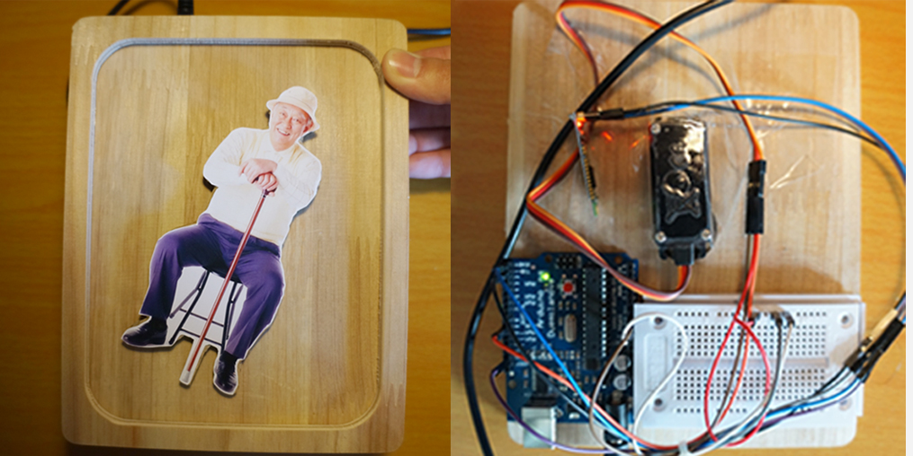
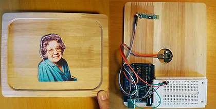

##  Elderly communication solution

We worked with HP to create a novel communication approach for the elderly. Learning new technologies like smartphones is not easy for them. We decided to redesign everyday objects they're familiar with instead of creating a new interface. We brainstorm how objects in their daily lives can be transformed into special interfaces for their social needs. We chose 'Photo Frame' because it reminds us of memories and people who are connected. Then we use "knock" as our key gesture, just like visiting your old friend.

<figure>
    
</figure>

    

        

            <figure>
                
            </figure>
            <figcaption>One on one</figcaption>
        

        

            <figure>
                
            </figure>
            <figcaption>Group chat</figcaption>
        

    

The communication system includes a motherboard and a number of branch-mounted devices that look like digital photo frame. Motherboard shows the master‘s picture, and each branch only shows one profile photo of a friend. They can reach out to each other by "knocking" on their profile photo just like they would when visiting an old friend in real life.

<figure>
    
</figure>

## How it works?

<figure>
    
</figure>

    

        

            <figure>
                
            </figure>
        

        

            <figure>
                
            </figure>
        

    

    

        

            <figure>
                
            </figure>
        

        

            <figure>
                
            </figure>
        

    

