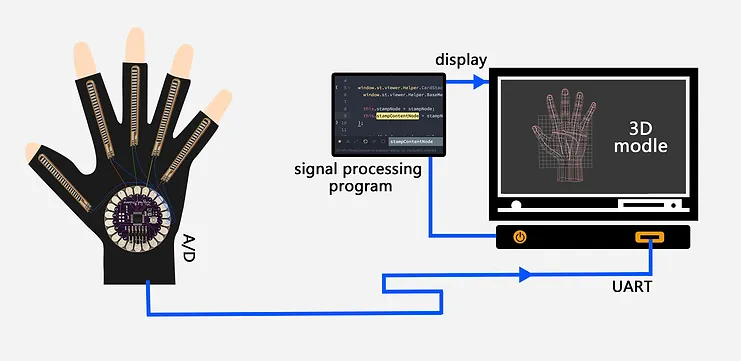

## Finger rehabilitation system for patients with chronic disease

Rehabilitation of fine motor skills is an essential part for post-stroke patients as hand function is crucial for accomplishing many functional activities in daily life. This project investigates both clinical and technical requirements for fine motor rehab. Two methods are proposed and tested for fine motor rehab.

First is the active sensor based methodology. Gloves with bend sensor is proposed to evaluate hand function during upper limb training with both gross and fine motor exercise. A prototype is developed for validating the concept of using bend sensor for finger joint movement monitoring. The second is Rebab System Software Design, a PC matching training system to help patients rehab.

<figure>
    
</figure>

## How it works?

This hand-rehab system comprise of a wearable device and a PC training system which can detect users' finger movement by using bend sensor. A programmed lilypad Arduino can read the analog sensor value from the bend sensor, which will change depending on the curvature of finger. Then the data will uploaded to computer, work with the 3D hand model in system.

<figure>
    
</figure>

    

        

            <figure>
                
            </figure>
        

        

            <figure>
                
            </figure>
        

    

<figure>
    
</figure>