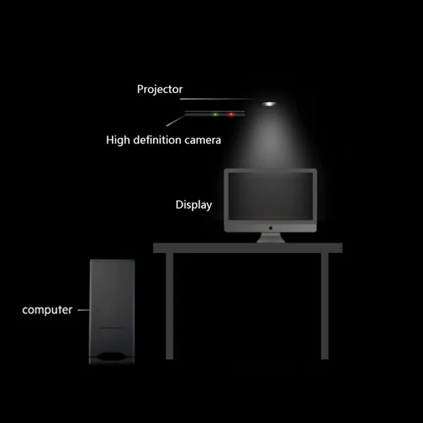

Interactions with nature have a huge impact on early learning. More and more app developers and traditional publishers are developing educational apps for mobile devices, like smartphones and tablets. The physical interaction ratio gradually decreases, which is especially important for preschoolers. How do these two worlds combine to create a novel interface that can inspire children's cognitive learning and help them understand the world?  We propose a new interactive and mixed learning experience for children to naturally combine the real and digital worlds. The device displays an animation when the camera detects child-drawn weather features like clouds, sun, etc. This will help them understand the weather formation. This combined information from a virtual world and physical touch of real-world objects to create a cohesive cognitive environment.

<iframe width="980" height="579" src="https://www.youtube.com/embed/7KNqxnv8Fn4" title="Tangible user interface for pre-school children learning" frameborder="0" allow="accelerometer; autoplay; clipboard-write; encrypted-media; gyroscope; picture-in-picture" allowfullscreen></iframe>

The resulting animation shows when  HDR camera detects certain shapes, like hand-drawn weather elements. For example, when a user puts the"sun" above the"cloud" it starts raining.

<figure>
    
    <figcaption>Figure 2</figcaption>
</figure>