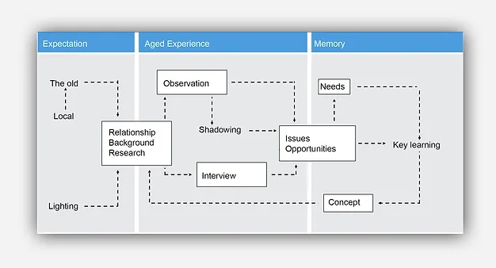
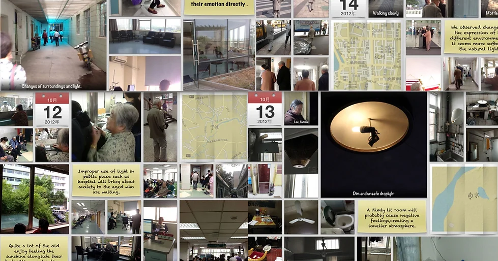
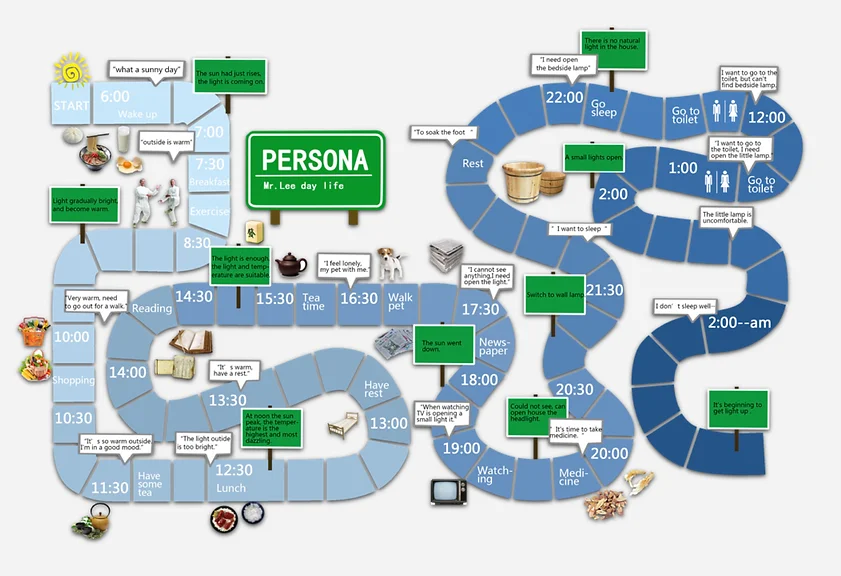
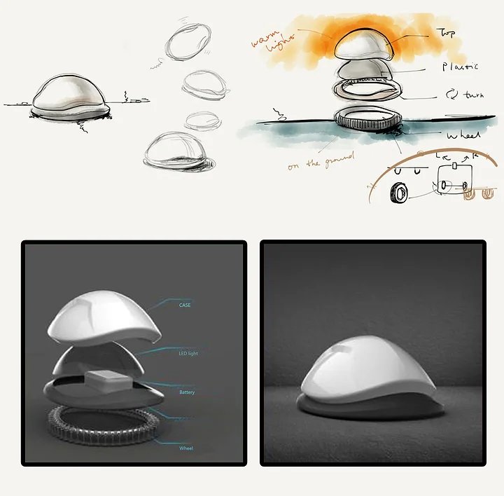
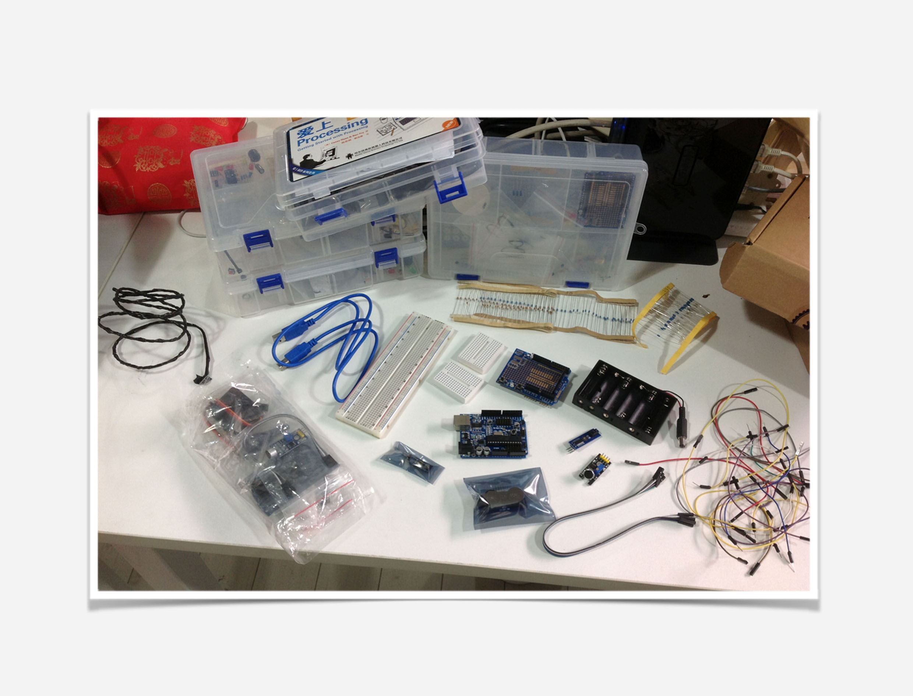
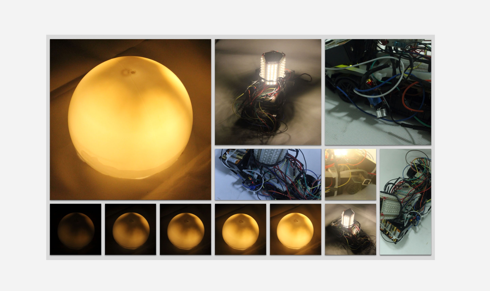

The aim is to provide a better lighting experience for Chinese elders when they wake up in the midnight. We did plentiful user research like following, observations, interviews, visits and logs to understand our target group's needs. The figure below shows part of research work we have done.

<figure>
    
</figure>

<figure>
    
    <figcaption>Experience Flow: An old man's one day</figcaption>
</figure>

<figure>
    
</figure>

We came up with a solution: an electronic-pet-like lighting product that can detect user movements via ultrasonic sensors and turn on automatically when the user wakes up at night. It will  turn off when the user goes to sleep. Elders don't have to press buttons during nighttime.

<figure>
    
</figure>

We use Arduino to build our prototype. 

<figure>
    
</figure>

<figure>
    
</figure>

<iframe width="813" height="487" src="https://www.youtube.com/embed/pGaXd0FGI4o" title="Lighting for Aged" frameborder="0" allow="accelerometer; autoplay; clipboard-write; encrypted-media; gyroscope; picture-in-picture" allowfullscreen></iframe>