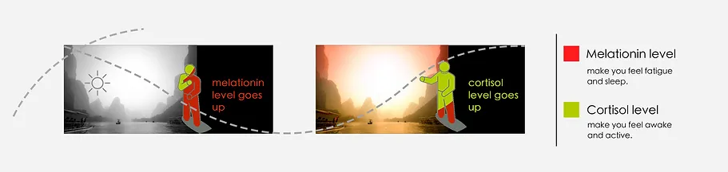
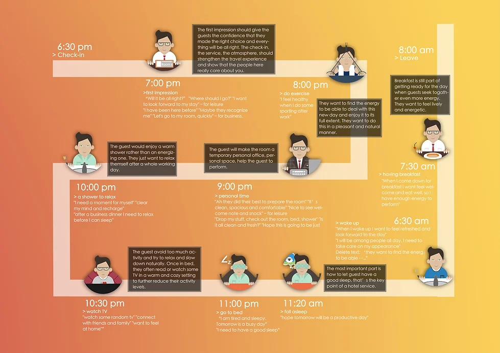
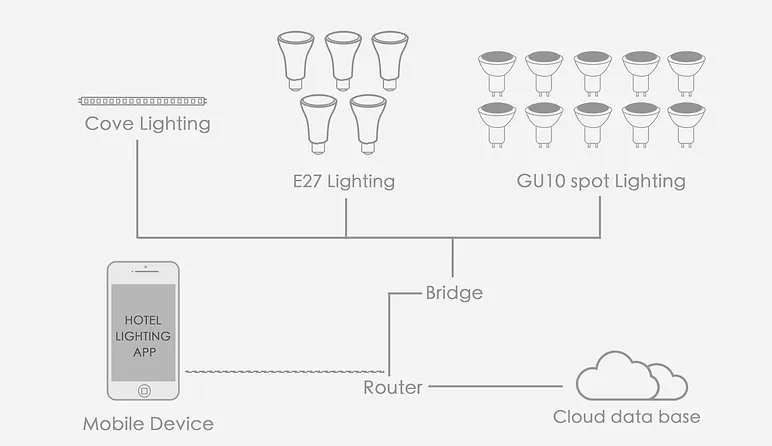

A good sleep is a key criteria for hotel stay. Mounting pressure from life and work on urban dwellers leads to increased demand for sleep solutions and related ‘remedies’ such as sleeping pills. All user wants is a good sleep: to fall asleep stay asleep and wake up refreshed. That's why we came up with "For a better stay" system (lighting experience solution).

## Light influences our body:

<figure>
    
    <figcaption>
        
The biological clock is regulated by light and darkness, and influences the cycles of night and day (circadian cycles). 

        
Combining a deep understanding of sleep, circadian rhythms and the effect of light.

    </figcaption>
</figure>

## User experience Flow:

User experience flow is a design method proposed by Philips Design.

By using experience flow, we can clearly see how a person spends their day in the hotel then find out the problem.

<figure>
    
</figure>

## Lighting for hotel stay System

<figure>
    
</figure>

<iframe width="1145" height="526" src="https://www.youtube.com/embed/eS5Ml8GIz3Q" title="lighting for hotel stay" frameborder="0" allow="accelerometer; autoplay; clipboard-write; encrypted-media; gyroscope; picture-in-picture" allowfullscreen></iframe>