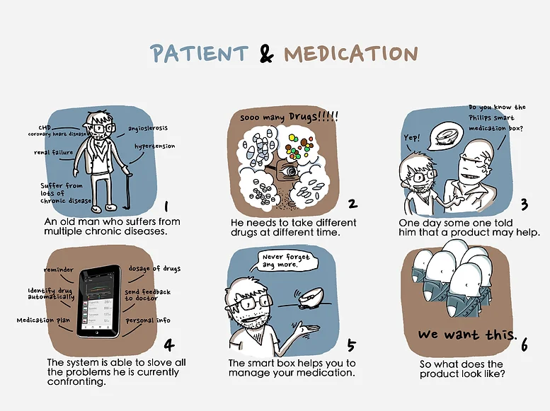
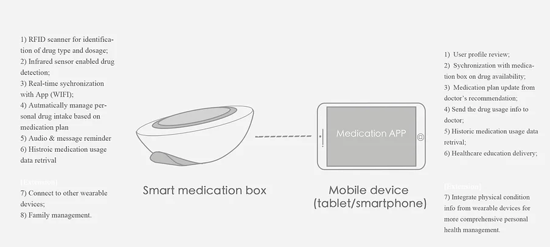
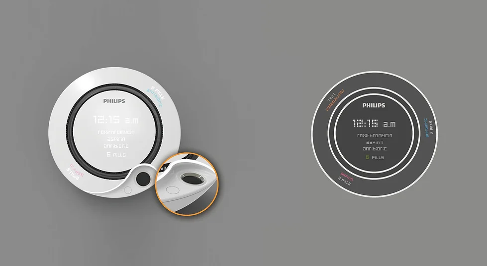
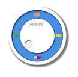
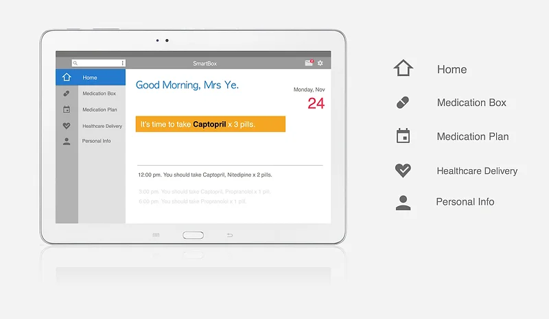
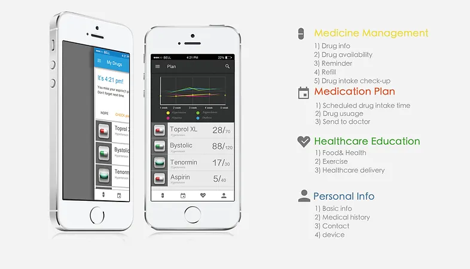

## An intelligent drug management apparatus and connected care solution

This invention proposed a new solution for patient drug management. The designed medication box utilizes the RFID technology for medicine recognition and enables automatic pill pack filling into the box. It has infrared light detection methodology to monitor the drug availability, thus to increase the compliance of the patient of drug intake and improve their life quality.   Moreover, a wireless connection to mobile tablet facilitates patient longitudinally manage drug intake and disease control. 

## Background of invention

According to the chronotherapeutics, the right time to take medicine not only improves the efficacy, but also reduces side reactions for patient. Patient with chronic disease (e.g. hypertension, diabetes) often need to take different drugs at a specific time, it can hardly for them to make no mistakes. The application of intelligent medication box is able to enhance patients’ compliance, better manage their chronic disease and avoid acute exacerbation.

<figure>
    
</figure>

## System Design

The system includes a new pill box with an RFID scanner to distinguish different drugs and a wifi module connecting disease management apps. With this pill box, pharmaceutical companies could put RFID label on the bottle lip, and the scanner will read and record the information contained in the label when patient aims the pill bottle lip at the scanner. The apparatus consists of a round and rotatable space, which is divided into several parts, to store and separate different kinds of pills or capsules. This effectively avoids mixing different drugs and taking the wrong medications. When there are only a few days left, the pill box sends reminders to the connected medical app.

<figure>
    
</figure>

<figure>
    
</figure>

<figure>
    
    <figcaption>Application Design</figcaption>
</figure>

<figure>
    
    <figcaption>Pad Version</figcaption>
</figure>

<figure>
    
    <figcaption>SmartPhone Version</figcaption>
</figure>