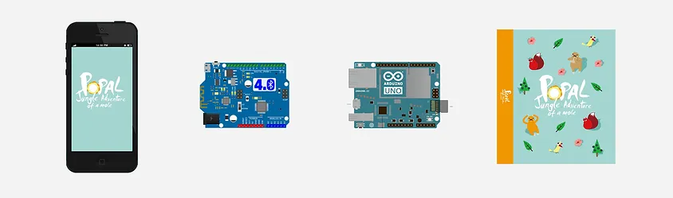
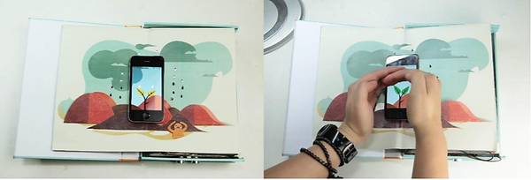
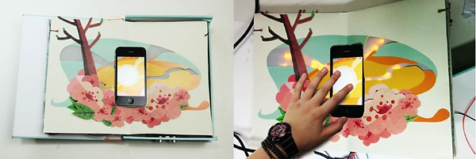
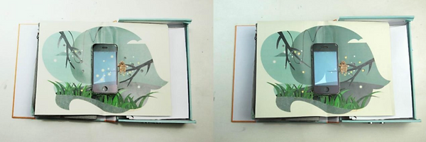
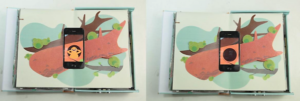

Connecting with the natural world is important for young children. Previous research on child cognition shows that comprehension of abstract concepts comes from interactions with physical objects. Getting children to interact with the physical world with relevant augmented digital information is what makes active learning possible. This has led us to think about creating a new kind of interface that can offer children tangible access. So we came up with a new way to interact-- play beyond the screen. We combine paper and touchscreen devices into one interface to create a new experience where both content and gestures are not limited to the screen, thereby combining multi-sensory and tangible interactions.

## How it works?
<figure>
     Bluno -> ArduinoUNO -> Popal" 
        alt="iphone -> Bluno -> ArduinoUNO -> Popal">
    <figcaption>Figure 1. iPhone -> Bluno -> ArduinoUNO -> Popal</figcaption>
</figure>

Popal is an interactive book that consists of a smartphone and physical book. Each page depicts an independent scenario, allowing children to explore the story through various interactive gestures. By combining the diversity of virtual information and physical features, Popal aims to offer a consistent cognitive environment and novel experiences for preschoolers.

<figure>
    
    <figcaption>When you put your hand above the seedling, it will stop raining.</figcaption>
</figure>

<figure>
    
    <figcaption>When you keep touching the sun on the screen, it will lighting up and warm the flowers.</figcaption>
</figure>

<figure>
    
    <figcaption>When you blow away the fireflies in the screen, it will fly into the paper "forest" outside the screen. </figcaption>
</figure>

<figure>
    
    <figcaption>When you get close to the “tree” in the screen, the mole will hide itself because it's shy!</figcaption>
</figure>