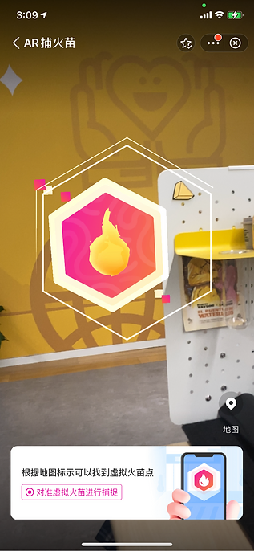
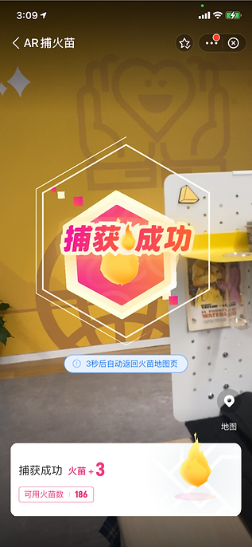
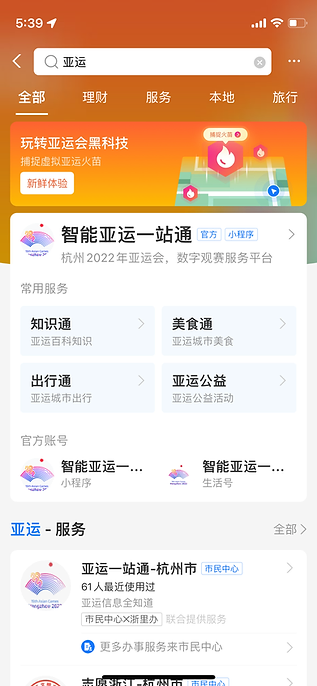
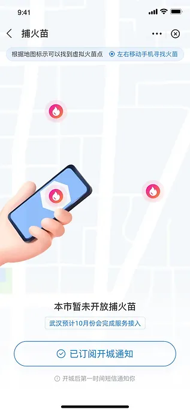
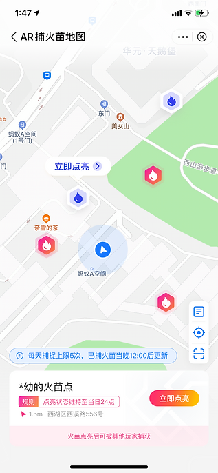

2022杭州亚运会支付宝官方合作伙伴。为在亚运会开幕前提高用户活跃，并在疫情以前传递亚运精神。以本届亚运“智慧，绿色“为主题”设计的火苗平台，包含AR扫火苗，AR地理位置捕捉火苗，互动火苗传递等新型交互方式。

    

        

            <figure>
                
                <figcaption>基于LBS捕捉或火苗</figcaption>
            </figure>
        

        

            <figure>
                
                <figcaption>捕捉成功</figcaption>
            </figure>
        

    

    

        

            <figure>
                
                <figcaption>支付宝搜索亚运一站通</figcaption>
            </figure>
        

        

            <figure>
                
                <figcaption>根据地理位置捕捉周围火苗</figcaption>
            </figure>
        

        

            <figure>
                
                <figcaption>用户可自定义放置火苗点</figcaption>
            </figure>
        

        

            <figure>
                
                <figcaption>火苗首页</figcaption>
            </figure>
        

    

