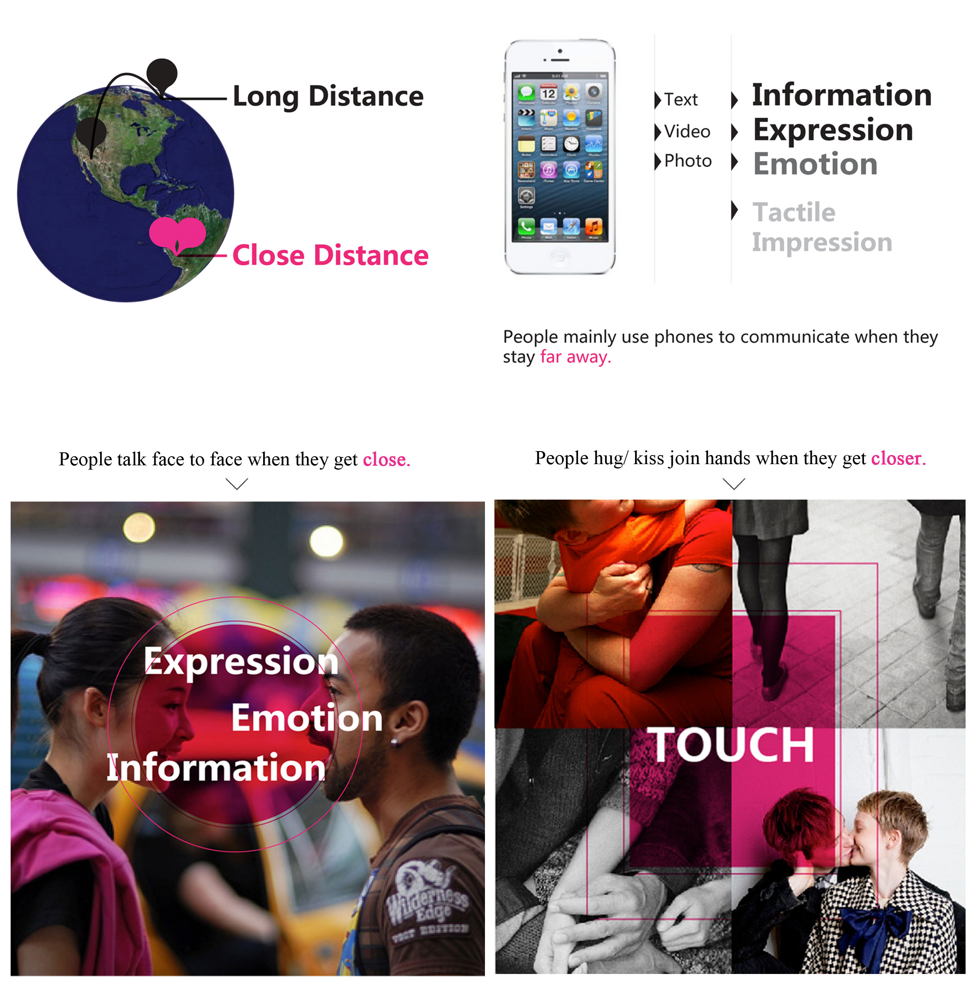
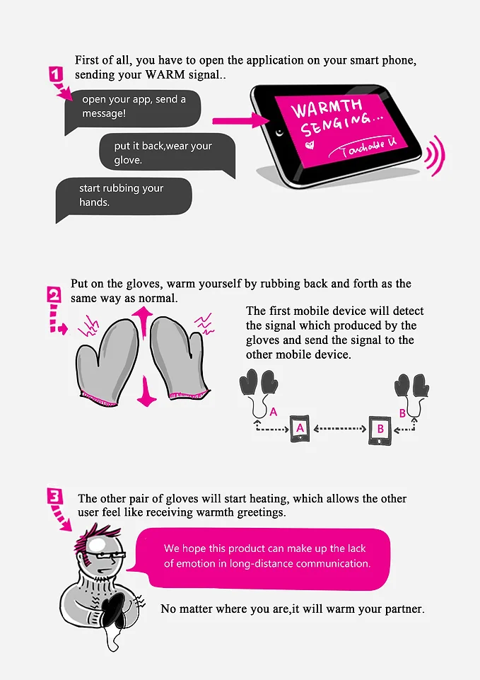
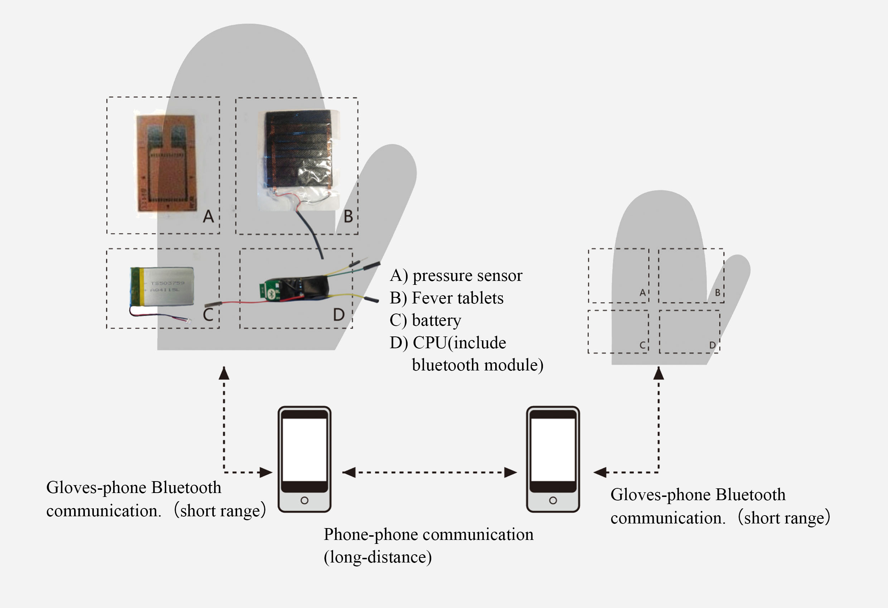
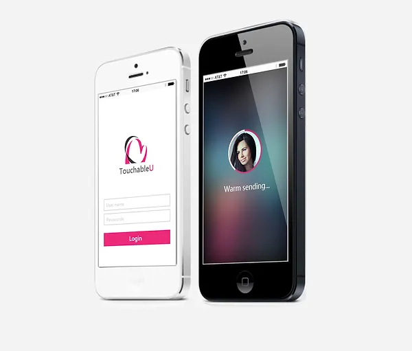

As technology evolved, communication became easier, but face-to-face communication still gave us more emotional expression than social apps like FaceTime or Skype. People usually make physical contact when they get close, like kisses or hugs, yet long-distance communication lacks emotion and action. Therefore, we are trying to add more physical features to long-distance communication, turning  our eyes to the Tangible User Interfaces.

<figure>
    
</figure>

<figure>
    
</figure>

## How it works?

The product includes two pairs of gloves and a mobile app. Each glove has a Bluetooth transceiver that will transmit a single message to the mobile device when the user rubs their hands, then the message will be sent by the app, when the other mobile device receives the message, it sends a signal to the other pair of gloves, then the gloves heat up. Users need not worry about distance anymore. 

<figure>
    
</figure>

<figure>
    
</figure>

<video width="100%" controls>
    <source src="https://user-images.githubusercontent.com/3339663/193617274-1d45b252-0370-4b16-90f1-fe5fbc077725.mp4" type="video/mp4">
</video>
