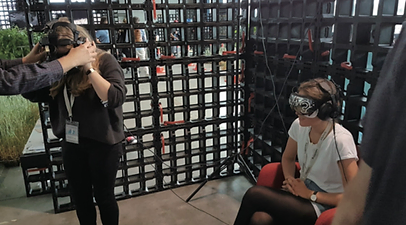
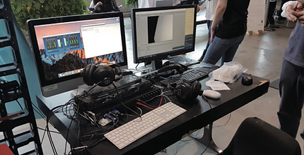
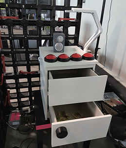
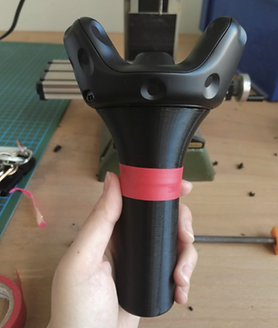
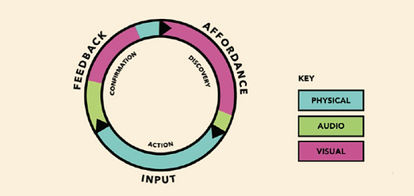
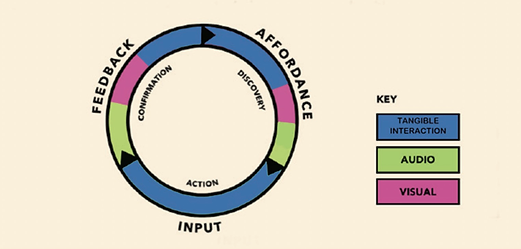

TRIALITY is an unconventional exploration of MR (or Mixed-reality) development that challenges the boundaries of our perception. In a mysterious laboratory, three participants have to synchronize to solve pending tasks. Each player perceives and controls only one sense of the same virtual character: touch, hearing or sight. To solve the problems, the players must work together as one unit to gain a complete understanding of what is happening in the virtual world.

TRIALITY是一个加入了有形交互界面的VR互动装置，我们创造了一个MR混合现实的环境，将在VR游戏中被弱化的触感做了增强。所有在TRIALITY中的物体用户不光可以在虚拟环境中看见同时可以触摸并且操作这些实体。该装置也需要用户调用不同感官视觉、听觉、触觉多人协同来完成任务。我们通过TRIALITY想探索的是在VR体验中是否加入有形交互可以增加用户的沉浸式体验。 

<video width="100%" controls poster="../assets/images/triality/triality.png">
    <source src="https://user-images.githubusercontent.com/3339663/193567628-71e2c534-51fc-4689-94c1-a59ae3fe8209.mp4" type="video/mp4">
</video>

## CONCEPT and PROTOTYPE

Two main features in TRIALITY are multisensory augmentation in both physical environment and digital space, and the multiplayer collaboration (see Figure 1). Virtual objects and environments were constructed in Unity, as shown in Figure 2. We then used sensors and gesture tracking devices such as Leap Motion to capture physical movements in real environments. The real-time transfer of data means that player interactions with the physical world can be synchronized to the virtual space we have built in the same environment with the same objects (see Figure 3). This project is a cooperative mixed-reality experience presented as the result of a collaboration between students of the Interface Cultures Master Program (University of Art and Design Linz) and the Master Program Software Engineering and Human-Centered Computing (University of Applied Sciences Upper Austria, Hagenberg). My contributions to this project include storytelling, narrative, tangible gesture interaction in the physical environment, 3D modeling of physical objects and participating in Unity VR systems.

    

        

            <figure>
                
                <figcaption>Figure1</figcaption>
            </figure>
        

       

            <figure>
                
                <figcaption>Figure2</figcaption>
            </figure>
        

    

    

        

            <figure>
                
                <figcaption>Figure3</figcaption>
            </figure>
        

    

## TANGIBLE INTERACTION

According to the game’s background setting, a number of interactive actions are required for the player to perform. By understanding Affordance, human perception and multisensory technologies, we need to design a series of scenarios that have natural interactive gestures included. The ideal goal of spatial computing is that interfaces will fade away and digital interactions will be humanized. In the “radio channel changing” scenario, for example, instead of using a controller to point at a virtual object, players need to manipulate a real radio that is specially designed. By rotating the degree of motion and hand gestures captured by sensors and cameras hidden in the radio, the data can then be synchronized to Unity so that other players can “see” their physical actions in a virtual world. As in the “open a safe” task, players need to adjust the actual rotation locker on the safe to a certain number before the locker can be opened. After the safe is opened, a “flashlight” is hidden inside, which is actually a 3D-printed model of handle attached to the controller (see Figure 4). By doing so, the player immediately knows how to use it even if they have been blindfolded. Compared to clicking a mouse or using a keyboard for tangible interaction, mixed-reality is much more interesting, and it’s a logical interactive way of applying the knowledge we already have about the real world.

    <figure>
        
        <figcaption>Figure 4</figcaption>
    </figure>

## RESEARCH RESULT

As shown in Figure 5, in traditional computer video game tutorials, the affordance in the first phase with which the player can interact is mostly GUI that tells them the label of each button that they need to press. It also usually comes with a sound similar to background music, a tone or dialogue. In conventional computer games, the input stage is physical but limited to buttons, joysticks or a controller that is not physically natural. The final feedback phase often incorporates some simple haptic feedback such as vibration, visual and sound.

New hardware and sensors are being developed to track location, breath rate, eye movement, hands and body movements. A new modality for tangible mixed-reality games like TRIALITY has emerged (see Figure 6).

In the first phase of TRIALITY, players must touch, see and hear to explore the game on their own without the interface guidelines. At this stage, the affordance of physical objects can be fully used to help them engage with the game and create an immersive experience. For example, when compared to a player standing in an empty space in a traditional VR game, the player can touch a real table or radio in a safe in TRIALITY and see the objects in the virtual world. The next step, input--the physical inputs we have--is tangible interaction, like turning on a flashlight, and turning on a radio channel. Instead of a simple button or keyboard, the actions involved in TRIALITY required the player to interact with the physical object directly. The last step will also be to combine of visual, audio and physical equally. Make sure all the players playing as different senses acquire the same experience, which is not possible in traditional VR games as usually only the visual part will be augmented.

    

        

            <figure>
                
                <figcaption>Figure5</figcaption>
            </figure>
        

       

            <figure>
                
                <figcaption>Figure6</figcaption>
            </figure>
        

    

