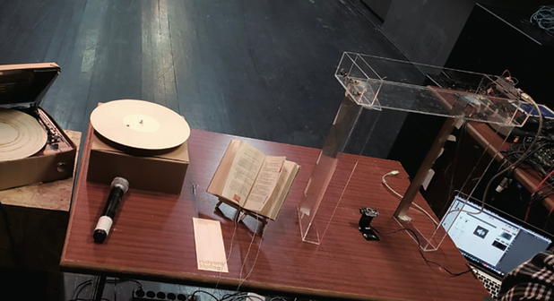
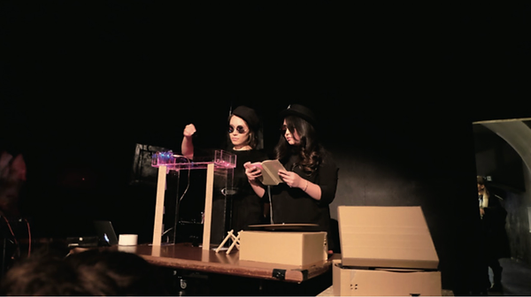
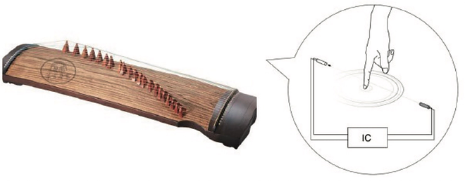
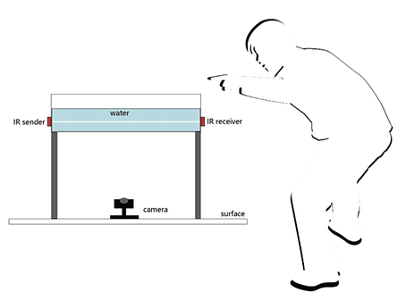
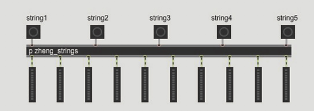

“Water Instrument” see Figure 1, a musical instrument that generates sound by interacting with water. Audiences can splash and stir water as they wish, and the Water Instrument shown in Figure 2 will then create a sound based on their movement and speed under the water. The sound is unique to everyone since not all individuals perform the exact same gestures. The timbre is specially designed to combines the nature of water and Zheng (a traditional Chinese string instrument).

    

        

            <figure>
                
                <figcaption>Figure 1</figcaption>
            </figure>
        

        

            <figure>
                
                <figcaption>Figure 2</figcaption>
            </figure>
        

    

## ZHENG 

The reason traditional instruments such as the Zheng have to be designed with a certain shape is that it helps in generating sound. However, with advanced MIDI (musical instrument digital interface), sound can be generated by a micro chip in any form. This raises the question, why shouldn’t we design the Zheng around the timbre of its sound rather the conventionally wooden shape (see Figure 3). The sound of Zheng is gentle and diversify just like water. Many famous GuZheng repertoires in China are to express the intense emotions and mimic people’s sensation to water, like “flowing water and high mountains”. Playing GuZheng also required years of professional training, which is hard for a normal audience to understand the beauty of it. On the contrary, everybody knows how to play with water intuitively. With Water Instrument, audiences are able to play a piece of a euphonic episode simply by randomly splashing and stirring the water. The unique sound of Water Instrument are specially designed to combine traditional Zheng sound and water flowing sound. We composed the sound mixed with different chords of Zheng and water flowing sound which will automatically change according to the audience’s movement underwater. Well-composed chords can make a random piece sound harmonious but unique because the water sound changes.

<figure>
    
    <figcaption>Figure 3</figcaption>
</figure>

## MUSIC DESIGN

The first part of the WATER Instrument sound is generated by the invisible “string”. I placed five invisible laser sensors on the double sides of the transparent container, each laser sensor representing a string. Laser sensors will be triggered by the position of the audience placing their hands on the instrument and the corresponding chord will be played. Audiences do not feel that they have touched any “strings”, but invisible “strings” are visible beneath the water (see Figure 4). Each string contains two notes in Zheng, each time a random note from the two is played when a string is being plucked. There are at least 25 possible combinations with all strings in place (see Figure 5). The second part of ‘the sound of water flowing’ which is generated and changed by capturing the audience’s movements in the water. As shown in Figure 4, a camera placed underneath the container captures the audience of action in the water. The combination of these two sounds give audience a diverse but coherent musical experience.

    

        

            <figure>
                
                <figcaption>Figure 4</figcaption>
            </figure>
        

        

            <figure>
                
                <figcaption>Figure 5</figcaption>
            </figure>
        

    

## SUMMARY

Conventional, tangible interfaces use solid objects enhanced with computation. I looked for integration in this study by using fluids, particularly water, as an interface because it shows that water as a natural element provides intrinsic appeal to the audience’s memories. The sense of touch is the most complex aspect of our body. The skin is our largest organ and it has millions of receptive cells. Marissa and Isaac have argued that “Touch is our most primitive sense because it is the first one we develop and the last one we lose when we die”. It is important to study whether the capabilities of what we call touch can be used as tactile references for interactive experiences.